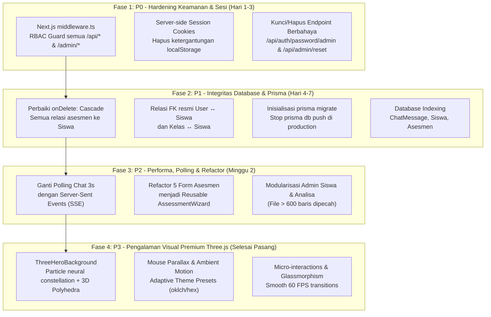

# 🚀 Blueprint Implementasi & Panduan Perbaikan BK-Online

**Project:** Bimbingan Konseling Online (SMP Negeri 1 Genteng)  
**Target:** Transformasi dari Prototype Rapuh menjadi Webapp Modern, Aman, dan Premium  
**Tech Stack:** Next.js 16 (App Router), React 19, Three.js, Prisma ORM, Neon PostgreSQL, Tailwind CSS v4, Lucide React

---

## 🎯 1. Matrix Prioritas Perbaikan & Fitur



---

## 💎 2. Implementasi Three.js yang Telah Dipasang

Komponen Three.js interaktif berkinerja tinggi telah dibuat dan diintegrasikan ke halaman utama:

- **Komponen:** [`src/components/three-hero-background.tsx`](file:///home/darkverst/workspace/bkonline/src/components/three-hero-background.tsx)
- **Halaman:** [`src/app/page.tsx`](file:///home/darkverst/workspace/bkonline/src/app/page.tsx)

### Fitur Visual & Optimasi Three.js:
1. **Interactive Polyhedral Constellation**:
   - Outer Icosahedron wireframe yang berotasi perlahan merepresentasikan dinamika bimbingan konseling dan eksplorasi minat bakat.
   - Inner glowing Octahedron dengan warna aksen lembut.
   - Torus Orbital Ring berotasi 3D memberikan kedalaman kedimensian.
2. **Dynamic Particle Field**:
   - 120 floating particles dengan canvas circular glow shader (tanpa beban external asset).
   - Animasi subtle drifting dengan continuous boundary wrapping.
3. **Cursor Parallax Interaction**:
   - Kamera dan geometri merespons pergerakan kursor pengguna dengan smooth linear interpolation (lerp).
4. **Adaptive Theming**:
   - Warna partikel dan geometri otomatis sinkron dengan tema aktif sekolah (Indigo, Emerald, Rose, Sky, Violet, Orange) via `presets[preset]?.hex`.
5. **Mobile & Low-End GPU Friendly**:
   - Otomatis fallback jika WebGL tidak didukung.
   - Adaptive scaling dan posisi di layar ponsel (`width < 1024`).
   - Clean disposal pada unmount (renderer, geometry, materials, listeners) untuk mencegah memory leak.

---

## 🔒 3. Panduan Teknis Perbaikan Keamanan (P0)

### 3.1 Buat `src/middleware.ts` untuk Route Protection
Terapkan proteksi terpusat pada Next.js Edge runtime:

```typescript
// src/middleware.ts
import { NextResponse } from "next/server"
import type { NextRequest } from "next/server"

export async function middleware(request: NextRequest) {
  const { pathname } = request.nextUrl
  
  // Ambil session token dari httpOnly cookie
  const sessionToken = request.cookies.get("bk_session")?.value

  // Proteksi Route Admin
  if (pathname.startsWith("/admin") || pathname.startsWith("/api/admin")) {
    if (!sessionToken) {
      return NextResponse.redirect(new URL("/login", request.url))
    }
    // Verifikasi role dari token / database session
  }

  // Proteksi Route Guru
  if (pathname.startsWith("/guru") || pathname.startsWith("/api/guru")) {
    if (!sessionToken) {
      return NextResponse.redirect(new URL("/login", request.url))
    }
  }

  return NextResponse.next()
}

export const config {
  matcher: ["/admin/:path*", "/guru/:path*", "/api/admin/:path*", "/api/guru/:path*"]
}
```

### 3.2 Amankan Endpoint Password Override
Hapus file `/api/auth/password/admin/route.ts` atau batasi mutlak hanya untuk Super Admin dengan validasi session server-side.

---

## 🗄️ 4. Panduan Teknis Schema Database & Cascade (P1)

Ubah [`prisma/schema.prisma`](file:///home/darkverst/workspace/bkonline/prisma/schema.prisma) agar penghapusan siswa tidak lagi memicu error `P2003`:

```prisma
model Siswa {
  id        String   @id @default(cuid())
  nama      String
  kelas     String
  nisn      String?  @unique
  userId    String?  @unique
  user      User?    @relation(fields: [userId], references: [id], onDelete: SetNull)
  createdAt DateTime @default(now())

  minatBakat    MinatBakat[]
  psikologi     Psikologi[]
  gayaBelajar   GayaBelajar[]
  karakterDiri  KarakterDiri[]
  mbti          Mbti[]
  retakeRequests RetakeRequest[]

  @@index([kelas, nama])
}

model MinatBakat {
  id        String   @id @default(cuid())
  siswaId   String
  siswa     Siswa    @relation(fields: [siswaId], references: [id], onDelete: Cascade)
  jawaban   Json     // gunakan tipe native Json
  skor      Json     // gunakan tipe native Json
  createdAt DateTime @default(now())

  @@index([siswaId, createdAt(sort: Desc)])
}
```

Jalankan migrasi resmi:
```bash
npx prisma migrate dev --name init_integrity_and_indexes
```

---

## ⚡ 5. Panduan Efisiensi Polling & Refactor Form (P2)

### 5.1 Ganti Polling Chat dengan Server-Sent Events (SSE)
- Buat route `/api/chat/sse/route.ts` yang mengalirkan event saat ada pesan baru pada `anonymousId` tersebut.
- Client cukup mendengarkan `const eventSource = new EventSource('/api/chat/sse?id=...')`.
- Menghemat 95% traffic request HTTP berkala.

### 5.2 Abstraksi Form Asesmen ke `<AssessmentWizard />`
Ekstrak state dan layout berulang (welcome screen, save progress localStorage, progress bar, retake check) ke satu reusable component:

```tsx
<AssessmentWizard
  storageKey="bk_asesmen_riasec"
  title="Asesmen Minat Bakat (RIASEC)"
  questions={questions}
  onComplete={handleSubmitScore}
/>
```
Hal ini mengeliminasi lebih dari 600 baris kode duplikasi di `src/components/asesmen/`.
